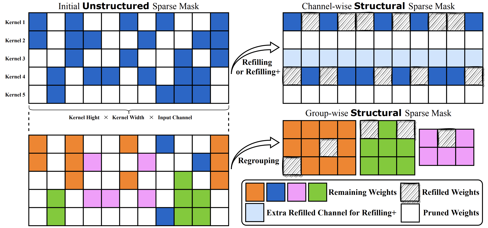

# Coarsening the Granularity: Towards Structurally Sparse Lottery Tickets

[](https://opensource.org/licenses/MIT)

Code for the paper: [Coarsening the Granularity: Towards Structurally Sparse Lottery Tickets](http://arxiv.org/abs/2202.04736)

Tianlong Chen, Xuxi Chen, Xiaolong Ma, Yanzhi Wang, Zhangyang Wang

## Overview

In this paper, we demonstrate the first positive result that a structurally sparse winning ticket can be effectively found in general. The core idea is to append “post-processing techniques” after each round of (unstructured) IMP, to enforce the formation of structural sparsity.

Specifically, we first “re-fill” pruned elements back in some channels deemed to be important, and then “re-group” non-zero elements to create flexible group-wise structural patterns. Both our identified channel- and group-wise structural subnetworks win the lottery, with substantial inference speedups readily supported by practical hardware.

Extensive experiments, conducted on diverse datasets across multiple network backbones, consistently validate our proposal, showing that the hardware acceleration roadblock of LTH is now removed. Detailed results are referred to our [paper](http://arxiv.org/abs/2202.04736).

## Method

Overview of our proposals including refilling, refilling+, and regrouping, which turn unstructured sparse mask into channel-wise and group-wise structured sparse masks.



## Prerequisites

Our code works with general version of PyTorch. We suggest use versions that are compatible with CUDA 10.2 since the profiling code requires CUDA 10.2.

For example:

```bash
conda create -n structlth11 python=3.8
conda install pytorch torchvision torchaudio cudatoolkit=11.3 -c pytorch
conda install -y matplotlib
pip install advertorch tqdm
```

or

```bash
conda env create -f environment_11.3.yml
```

Then patch the `advertorch` package and create dirs:

```bash
patch -p0 ~/anaconda3/envs/structlth11/lib/python3.8/site-packages/advertorch/attacks/fast_adaptive_boundary.py zero_grad.patch
mkdir pretrained_model
```

Please notice that we need `nvcc` to be installed.

## Experiments

### Finding Lottery Tickets with IMP

```bash
python -u main_imp.py --data datasets/cifar10 --dataset cifar10 --arch res18 --save_dir resnet18_cifar10_lt_0.2_s1_rewind_16 --init pretrained_model/res18_cifar10_1_init.pth.tar --seed 1 --lr 0.1 --fc --rate 0.2 --pruning_times 10 --prune_type rewind_lt --epoch 160 --decreasing_lr 80,120 --rewind_epoch 16 --weight_decay 1e-4 --batch_size 128
```

### Retrain Networks with Refill

```bash
i=1
python -u main_eval_fillback.py --data datasets/cifar10 --dataset cifar10 --arch res18 --pretrained resnet18_cifar10_lt_0.2_s1_rewind_16/1checkpoint.pth.tar --mask_dir resnet18_cifar10_lt_0.2_s1_rewind_16/${i}checkpoint.pth.tar --fc --prune-type lt --seed 1 --epoch 160 --decreasing_lr 80,120 --weight_decay 1e-4 --batch_size 128 --lr 0.1 --save_dir refill
```

### Retrain Networks with Regroup

```bash
i=1
python -u main_eval_regroup_retrain.py --data datasets/cifar10 --dataset cifar10 --arch res18 --pretrained resnet18_cifar10_lt_0.2_s1_rewind_16/1checkpoint.pth.tar --mask_dir resnet18_cifar10_lt_0.2_s1_rewind_16/${i}checkpoint.pth.tar --fc --prune-type lt --seed 1 --epoch 160 --decreasing_lr 80,120 --weight_decay 1e-4 --batch_size 128 --lr 0.1 --save_dir regroup
```

## Profiling

The code for profiling is under `profile`.

To calculate the time of regroup conv, `cd profile/regroup_conv` and `python split.py <checkpoint> <dir_to_save>`. For each extracted sparse mask, run `python conv.py --kernel_file <sparse_mask_checkpoint>`.

To calculate the time of cudnn conv, `cd profile/cudnn_conv` and run `python conv.py --kernel_file <sparse_mask_checkpoint>`.

## Todo

- [ ] Checkpoints
- [ ] Upgrade codes to support CUDA 11.x.

## Aknowledgement

Many thanks Prof. Jiang from [paper](https://doi.org/10.1145/3410463.3414648) for providing implementations of acceleration and helpful discussions!

## Citation

```latex
@misc{chen2022coarsening,
      title={Coarsening the Granularity: Towards Structurally Sparse Lottery Tickets}, 
      author={Tianlong Chen and Xuxi Chen and Xiaolong Ma and Yanzhi Wang and Zhangyang Wang},
      year={2022},
      eprint={2202.04736},
      archivePrefix={arXiv},
      primaryClass={cs.LG}
}

@inproceedings{Rumi2020acc,
      author = {Rumi, Masuma Akter and Ma, Xiaolong and Wang, Yanzhi and Jiang, Peng},
      title = {Accelerating Sparse CNN Inference on GPUs with Performance-Aware Weight Pruning},
      year = {2020},
      isbn = {9781450380751},
      publisher = {Association for Computing Machinery},
      address = {New York, NY, USA},
      url = {https://doi.org/10.1145/3410463.3414648},
      doi = {10.1145/3410463.3414648},
      booktitle = {Proceedings of the ACM International Conference on Parallel Architectures and Compilation Techniques},
      pages = {267–278},
      numpages = {12},
      keywords = {cnn pruning, sparse convolution, gpus},
      location = {Virtual Event, GA, USA},
      series = {PACT '20}
}
```
